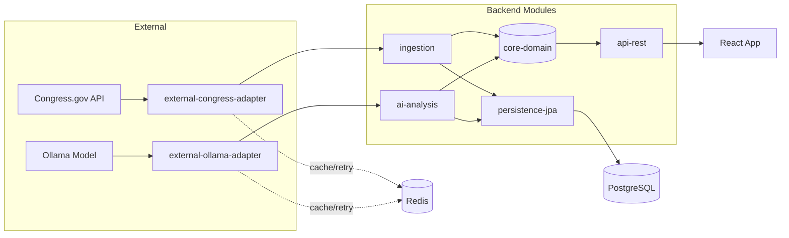
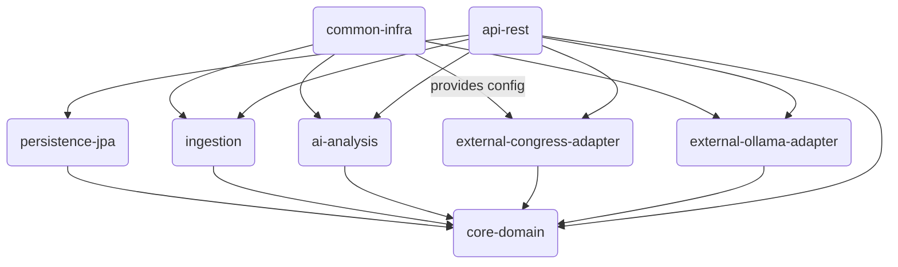
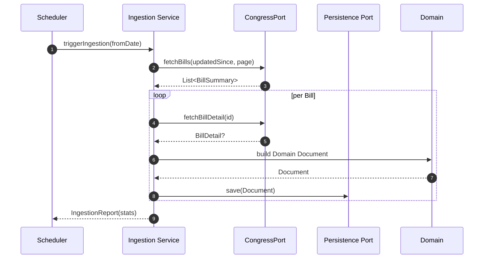

# LegisTrack

LegisTrack is an AI-driven legislative document tracking and exploration platform. It combines a Kotlin/Spring backend, a React + TypeScript frontend, and Docker Compose orchestration to ingest, analyze, and surface legislative documents using modern AI techniques such as natural language processing, semantic embeddings, summarization, and semantic search.

This README gives a concise overview, quickstart instructions, development hints, and notes for contributors.

## Key features (AI-driven)
- Document ingestion pipeline with metadata extraction and normalization
- NLP-powered processing: language detection, tokenization, named-entity extraction, and classification
- Embeddings and semantic search for meaning-based retrieval across documents
- Summarization and question-answering over documents (extractive/abstractive)
- AI-assisted UI: relevance scoring, highlight extraction, and suggested follow-ups

> Note: Specific AI models and providers are pluggable. See the `backend` configuration and environment variables for model/provider selection.

## Architecture

- Backend: Kotlin + Spring (Gradle) — document ingestion, AI orchestration, REST API
- Frontend: React + TypeScript — user interface, document feed, detail and search views
- Orchestration: `docker-compose.yml` for local development and quick deployments

### High-Level Component Flow (Current → Target Modularization)



### Dependency Direction (Enforced)



### Ingestion Sequence (Simplified)



### Frontend Feature Slices (Planned)

```mermaid
flowchart LR
	app[app/ providers]
	docs[features/documents]
	ingest[features/ingestion]
	analysis[features/analysis]
	shared[shared/{ui,api,lib,config}]
	entities[entities/{document,analysis}]
	pages[pages/*]
	widgets[widgets/*]
	app --> docs --> pages
	app --> ingest --> pages
	app --> analysis --> pages
	docs --> entities
	ingest --> entities
	analysis --> entities
	docs --> shared
	ingest --> shared
	analysis --> shared
	pages --> widgets --> shared
```

### ASCII Module Snapshot

```
core-domain
	↑        ↑        ↑        ↑
	│        │        │        │
ingestion  ai-analysis  external-congress-adapter  external-ollama-adapter
					\      |      /
					 \     |     /
					 persistence-jpa (JPA only)
								↑
						 api-rest (controllers & boot)
```

For the detailed migration phases and checklists see the modularization section in `TODO.md` (transitioning to a dedicated README subsection once phases progress).

### Plaintext / Unicode Diagrams (Quick Reference)

Module Dependency Matrix (rows depend on columns = X):

```
								core  persist  ingest  ai  congress  ollama  infra  api
core-domain       -      -       -     -     -         -      -     -
persistence-jpa   X      -       -     -     -         -      -     -
ingestion         X      -       -     -     -         -      (cfg)  -
ai-analysis       X      -       -     -     -         -      (cfg)  -
ext-congress      X      -       -     -     -         -      (cfg)  -
ext-ollama        X      -       -     -     -         -      (cfg)  -
common-infra      -      -       -     -     -         -      -     -
api-rest          X      X       X     X     X         X      X     -
```

Legend: `(cfg)` = consumes configuration beans only; `X` = compile-time dependency; `-` = no dependency.

Phase Timeline (✓ = completed, □ = pending; initial state):
```
Phase 0: Ports & Baseline   □
Phase 1: core-domain        □
Phase 2: persistence-jpa    □
Phase 3: Adapters split     □
Phase 4: Ingestion module   □
Phase 5: AI module          □
Phase 6: api-rest isolate   □
Phase 7: common-infra       □
Phase 8: Testing alignment  □
Phase 9: Harden boundaries  □
Phase10: Cleanup/docs       □
```

High-Level Data Flow (plaintext):
```
Congress.gov -> Congress Adapter -> Ingestion -> Domain Models -> Persistence (Postgres)
																								|                 ↑
																								|                 |
																				 AI Analysis <- AI Adapter (Ollama)
																								|
																								v
																					 API (REST) -> Frontend (React)
```

Ingestion Sequence (compact):
```
Scheduler
	| trigger
	v
Ingestion Service --fetch bills--> Congress Adapter --HTTP--> Congress.gov
	|<--list summaries--|
	| loop
	|--fetch detail--> Congress Adapter
	|<--detail?-------|
	| build domain object
	|--save--> Persistence (JPA/DB)
	v
Report stats
```

Caching & Retry Placement:
```
External Calls: Congress Adapter, Ollama Adapter
Mechanisms: @Cacheable + Retry(backoff≥2s, jitter) configured in common-infra
Cache Store: Redis (string keys: service-method_param1_...)
```

Frontend Feature Composition:
```
App Providers
	├─ QueryClient
	├─ Router
	└─ Theme (future)
			|
			├─ Pages
			|    ├─ DocumentsPage
			|    |    └─ DocumentFeedWidget -> (features/documents components + queries)
			|    └─ DocumentDetailPage -> (details + analysis panel)
			└─ Other Future Pages
```

### Box-Drawing Diagrams (Detailed Views)

Layered Backend Architecture:
```
┌─────────────────────────────────────────────────────────┐
│                      api-rest (HTTP)                   │  ← Controllers / DTO mappers / Error envelopes
├─────────────────────────────────────────────────────────┤
│        ingestion            │         ai-analysis       │  ← Application services (use ports)
├─────────────────────────────┴───────────────────────────┤
│                   core-domain (pure)                    │  ← Domain models, value objects, events, invariants
├─────────────────────────────────────────────────────────┤
│                    persistence-jpa (JPA)                │  ← Repositories, entities, mappers
├─────────────────────────────────────────────────────────┤
│ external-congress-adapter │ external-ollama-adapter    │  ← Adapters implement ports (HTTP / AI)
├─────────────────────────────────────────────────────────┤
│                    common-infra (config)                │  ← Caching, retry, metrics, security
└─────────────────────────────────────────────────────────┘
```

HTTP Request Lifecycle (example: GET /api/documents/{id}):
```
Client → Controller → Application Service (ingestion/ai if needed) → Domain Service → Repository Port → JPA Repo → DB
		  ↓                          ↑
		Mapper ← Domain Model ← Mapper
```

AI Analysis Pipeline:
```
┌────────────┐   ┌────────────────┐   ┌──────────────────┐   ┌───────────────┐   ┌────────────────┐
│ Ingestion  │→→│ New Document    │→→│ ai-analysis Svc   │→→│ AiModelPort    │→→│ Ollama Adapter  │
└────────────┘   └────────────────┘   └──────────────────┘   └──────┬────────┘   └──────┬─────────┘
											   │                    │
									 Prompt build / params             HTTP POST
											   │                    │
									     ┌────────▼────────┐           │
									     │   Model Output  │◀──────────┘
									     └────────┬────────┘
											  Persist (Repository Port) → DB
```

Frontend Composition Overview:
```
┌───────────────┐    ┌────────────────┐    ┌────────────────┐
│ app/providers │→→ │   pages/*       │→→ │ widgets/*       │
└──────┬────────┘    └──────┬─────────┘    └──────┬─────────┘
	 │                     │                     │
	 │               ┌─────▼─────┐         ┌─────▼─────┐
	 │               │ features/ │         │ shared/ui │
	 │               └─────┬─────┘         └─────┬─────┘
	 │                     │                     │
	 │             ┌───────▼────────┐      ┌─────▼──────┐
	 │             │ entities/*     │      │ shared/api │
	 │             └────────────────┘      └────────────┘
```

Build & CI Flow (simplified future state):
```
┌──────────┐  lint/detekt  ┌──────────────┐  unit tests  ┌────────────────┐  integration  ┌─────────────┐  package  ┌────────────┐
│ Checkout │─────────────▶│ Validate Job │────────────▶│  Unit / Port   │──────────────▶│ Integration │──────────▶│  API Image │
└──────────┘               └──────────────┘             └────────────────┘               └─────────────┘          └────────────┘
																	│ publish
																	▼
															     Registry / Deploy
```

Organization Analogy (roles mapping example):
```
				┌───────────┐
				│   API     │ (public interface / controllers)
				└─────┬─────┘
					│
		  ┌───────────────┴───────────────┐
		  │                               │
	  ┌─────┴─────┐                   ┌─────┴─────┐
	  │ Ingestion  │                   │  AI Svc   │
	  └─────┬─────┘                   └─────┬─────┘
		  │                               │
	┌───────┴───────┐               ┌───────┴───────┐
	│ Domain Logic  │               │   Ports       │
┌─────┴─────┐   ┌─────┴─────┐         └───────────────┘
│Persistence│   │ Adapters  │ (Congress/Ollama)
└───────────┘   └───────────┘
```


Repository layout (top-level):

- `backend/` — Kotlin/Spring code, Gradle build
- `frontend/` — React + TypeScript app (Create React App / Vite-style layout)
- `docker-compose.yml` — compose setup for backend, frontend (or built assets) and supporting services

## Prerequisites

- Docker & Docker Compose (recommended for first-run)
- Java 17+ (if running backend locally)
- Node.js 18+ and npm/yarn (if running frontend locally)
- (Optional) Access to AI model/service provider (API key or local LLM)

## Quick start (Docker Compose)

From the project root run:

```bash
docker-compose up -d
```

This brings up the backend and frontend (and any configured services). Allow a few moments for services to initialize. Check logs with `docker-compose logs -f`.

Default ports (verify in your local config):
- Backend API: http://localhost:8080
- Frontend (dev): http://localhost:3000 or static assets served by Nginx if using the production build

## Run locally (development)

Backend (Kotlin/Spring):

```bash
cd backend
./gradlew bootRun
```

Look for Spring Boot startup logs and an HTTP listening port (commonly 8080). Configurations are under `backend/src/main/resources` (profiles and `application-*.properties` or `.yml`).

Frontend (React/TypeScript):

```bash
cd frontend
npm install
npm run start
```

The frontend will open a hot-reloading development server (commonly http://localhost:3000) and point API requests to the configured backend URL.

## Configuration & AI provider

The project is designed to keep AI provider selection configurable via environment variables and backend config files. Typical knobs include:

- MODEL_PROVIDER (e.g., OpenAI, local LLM)
- API keys or credentials (set as env vars or docker secrets)
- EMBEDDING_DIM, VECTOR_STORE settings (if using local vector DB)

Check `backend/src/main/resources` and `docker-compose.yml` for exact variable names used in this repository.

## Testing

- Backend: run Gradle tests

```bash
cd backend
./gradlew test
```

- Frontend: run unit tests

```bash
cd frontend
npm test
```

## Contributing

Contributions are welcome. A few guidelines:

- Open an issue to discuss major changes or new AI integrations (models/providers)
- Keep AI model keys and secrets out of source control; use env vars or secrets management
- Write tests for new features (backend unit tests, frontend component tests)
- Document new configuration options and update this README when behavior changes

## Security and privacy

The platform may process sensitive legislative or personal data depending on ingestion sources. Follow these precautions:

- Secure API keys and model credentials
- Configure data retention and deletion policies in the backend
- Audit which external AI services data is sent to and consider on-prem or private models when privacy-sensitive

## Roadmap & ideas

- Plug-and-play AI backends (OpenAI, Anthropic, local LLMs)
- Vector DB integration (e.g., Milvus, Pinecone, Weaviate) for scale and fast semantic retrieval
- Interactive Q&A over legislative corpora with conversational memory
- Document lineage tracking, cross-references and impact analysis

## Where to look in the code

- Backend source: `backend/src/main/kotlin` and resources in `backend/src/main/resources`
- Frontend source: `frontend/src` (components, hooks, services)
- Docker compose orchestration: `docker-compose.yml`

## License & contact

Specify your project's license here (e.g., MIT) and provide contact or maintainer information.

## License

This project is licensed under the MIT License — see the `LICENSE` file in the project root for details.

## Authorship

This project and the initial codebase and documentation were generated with the assistance of an AI coding assistant. The AI authored the initial project scaffold and README content on 2025-08-15. Human review and verification are recommended for production use — check configuration, secrets, and licenses before deploying.

