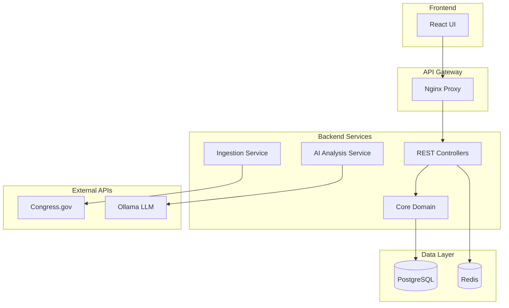

# LegisTrack

AI-powered legislative document tracking and analysis platform that combines real-time data ingestion with intelligent document analysis.

[](https://opensource.org/licenses/MIT)
[](https://kotlinlang.org/)
[](https://spring.io/projects/spring-boot)
[](https://reactjs.org/)
[](https://www.typescriptlang.org/)

[Quick Start](#quick-start) • [Architecture](#architecture) • [API Documentation](#api-documentation) • [Development](#development) • [Knowledge Base](#knowledge-base-obsidian-vault)

## Overview

LegisTrack is a comprehensive legislative intelligence platform that automates document tracking and provides AI-powered analysis of legislative activities. The platform integrates with official government APIs and uses local AI models for privacy-conscious document analysis.

### Key Features

- **Automated Data Ingestion**: Real-time collection from Congress.gov and GovInfo APIs
- **AI-Powered Analysis**: Local LLM integration via Ollama for document analysis
- **Advanced Search**: Comprehensive document search with filtering and pagination
- **Analytics Dashboard**: Summary analytics and trend visualization
- **Modern Architecture**: Clean hexagonal architecture with modular design
- **Container-Ready**: Complete Docker Compose setup for easy deployment


## Technology Stack

**Backend**
- Kotlin + Spring Boot (WebFlux)
- PostgreSQL with Flyway migrations
- Redis caching
- Ollama for AI analysis

**Frontend**
- TypeScript + React 18
- Tailwind CSS
- React Query for state management

**Infrastructure**
- Docker & Docker Compose
- Nginx reverse proxy
- Hexagonal architecture pattern

## Architecture

LegisTrack follows a hexagonal architecture pattern with clear separation between domain logic and infrastructure concerns.



### Design Principles

- **Hexagonal Architecture**: Clean separation between business logic and infrastructure
- **Reactive Programming**: Non-blocking I/O with Spring WebFlux
- **Modular Design**: Multi-module Gradle structure for maintainability
- **Local AI Processing**: Privacy-conscious analysis using Ollama

## Project Structure

```
LegisTrack/
├── backend/                   # Spring Boot application
│   ├── core-domain/           # Domain models and business logic
│   ├── api-rest/              # REST controllers and web layer
│   ├── persistence-jpa/       # Database entities and repositories
│   ├── ingestion/             # Data ingestion services
│   ├── ai-analysis/           # AI analysis orchestration
│   └── external-*-adapter/    # External API integrations
├── frontend/                  # React TypeScript application
│   ├── src/components/        # UI components
│   ├── src/services/          # API client
│   └── src/types/             # TypeScript definitions
└── docker-compose.yml        # Development stack
```

## Knowledge Base (Obsidian Vault)

An internal engineering & domain knowledge base lives in an Obsidian vault at `obsidian/LegisTrack`. This lets contributors keep architecture decision records (ADRs), ingestion nuances, AI prompt rationale, and operational runbooks close to the code while avoiding cluttering the root with many markdown files.

### Opening the Vault

1. Install [Obsidian](https://obsidian.md/)
2. In Obsidian choose: "Open folder as vault" and select `obsidian/LegisTrack`
3. The starter note `Welcome.md` can be replaced with project specific overview (do so in a focused PR)

### What Gets Committed

Tracked (stable / intentional):
- `*.md` knowledge notes
- `.obsidian/core-plugins.json` (enables a minimal, consistent plugin set)
- `.obsidian/app.json` (kept minimal / empty to avoid user‑specific settings bleed)

Ignored (volatile / personal layout):
- `.obsidian/workspace.json` (pane/layout state)
- `.obsidian/graph.json`, `appearance.json` (visual prefs)
- Undo history and transient caches

Rationale: keeping only deterministic config prevents noisy diffs while ensuring every contributor gets the same baseline features (file explorer, search, backlinks, etc.).

### Authoring Guidelines

| Guideline | Reason |
|-----------|-------|
| Prefer small, focused notes over large monolith pages | Easier linking & reuse |
| Use `[[Wiki Links]]` between related concepts (e.g., `[[Ingestion Pipeline]]`) | Builds graph context for discovery |
| Start any Architecture Decision with filename prefix `ADR-XXXX-` | Enables chronological sorting |
| Never store secrets, API keys, or proprietary data | Security (SEC) priority |
| Keep runtime operational logs out of the vault | Prevent repo bloat |
| Do NOT add new markdown files outside this vault (except updating `README.md`) | Enforces doc locality per project rules |

### Adding New Knowledge

1. Create or open a note inside the vault
2. Link it from an appropriate index note (create `Index.md` if helpful)
3. Commit with a message like: `docs(vault): add ADR-0123 ingestion retry tuning`

### Future Enhancements

Potential low‑risk improvements (not yet implemented):
- Introduce an `Index.md` or `README.md` inside the vault acting as a table of contents
- Add lightweight tagging conventions (e.g., `#adr`, `#runbook`, `#prompt`)
- Script to export selected notes to external docs site (out of scope now)

These should be proposed in an issue referencing priorities (SEC > DATA > CORR > REL ...) before implementation.


## Prerequisites

- Docker 24.0+ and Docker Compose 2.0+
- Git

*For local development: Java 21+, Node.js 18+*

## Quick Start

### 1. Clone and Start

```bash
git clone https://github.com/your-username/LegisTrack.git
cd LegisTrack

# Start all services
docker compose up -d
```

### 2. Access Services

| Service | URL | Description |
|---------|-----|-------------|
| **Frontend** | http://localhost | React UI |
| **Backend API** | http://localhost:8080 | REST API |
| **Ollama** | http://localhost:11434 | AI inference |

### 3. Setup AI Models (Optional)

```bash
# Pull AI model for analysis features
docker exec legistrack-ollama ollama pull gpt-oss:20b
```

### 4. Verify Installation

```bash
# Check backend health
curl http://localhost:8080/actuator/health

# Test API
curl http://localhost:8080/api/documents?page=0&size=5
```

## Configuration

### Multi-Module Resource Placement & Driver Auto-Detection

The executable Spring Boot fat jar is produced by the `api-rest` module. Place runtime `application.properties` / profile-specific overrides **inside** `backend/api-rest/src/main/resources` so they are included in the packaged jar. (The root aggregator module disables its own source sets; properties there are ignored at runtime.)

We intentionally do **not** hard-code `spring.datasource.driver-class-name` so integration tests can switch to in-memory H2 with only a URL override (e.g. `jdbc:h2:mem:test;MODE=PostgreSQL`). Spring Boot will auto-detect the proper driver (PostgreSQL in Docker / H2 in tests) based on the JDBC URL. This avoids dialect and driver conflicts and keeps tests lightweight while production stays on Postgres.

If you add new external `app.*` configuration keys, prefer adding a safe default (e.g. `:dummy-test-key`) to prevent test context failures when environment variables are absent. For stronger type-safety, a future enhancement is to introduce `@ConfigurationProperties` classes for these groups (e.g. `AppCongressApiProperties`).

### Typed Configuration Properties

The following external integration settings now use typed `@ConfigurationProperties` for safer refactoring and IDE metadata:

| Prefix | Class | Purpose |
|--------|-------|---------|
| `app.congress.api` | `CongressApiProperties` | Congress API credentials, base URL, retry & circuit breaker tuning (validated) |
| `app.ollama` | `OllamaProperties` | Ollama base URL, model name, bootstrap toggle (validated) |
| `app.scheduler.data-ingestion` | `DataIngestionSchedulerProperties` | Enable flag, cron expression, lookback days for scheduled ingestion (validated) |

They are enabled via `@EnableConfigurationProperties` in a single `WebConfig` (the previously duplicated root config class was removed to avoid double registration). Add new fields to these classes instead of scattering additional `@Value` injections. Provide safe defaults so the test profile loads without external secrets. Regeneration of configuration metadata (for IDE auto-complete / metadata JSON) is handled by the `spring-boot-configuration-processor` added to modules that declare configuration properties (e.g. adapters and ingestion). If you introduce a new module with `@ConfigurationProperties` classes, remember to add the processor there as an `annotationProcessor` dependency.

#### Property Validation & Fail-Fast

All configuration properties above now use Bean Validation to fail fast on invalid startup values:

- `CongressApiProperties`: `@NotBlank` for API key (if required in the future), `@Pattern` for base URL format, min/max bounds on retry attempts, circuit breaker threshold & cooldown, and adaptive retry suppression percentage.
- `OllamaProperties`: `@Pattern` restricts base URL to empty or valid http/https; `@NotBlank` ensures a model name is configured when AI features are enabled.
- `DataIngestionSchedulerProperties`: validation for cron presence, non-negative lookback days, and enabled flag coherence.

Invalid settings surface as clear startup exceptions instead of latent runtime errors. When adding new fields, prefer adding appropriate `@NotBlank`, `@Min`, `@Max`, or `@Pattern` constraints and safe defaults so CI/test profiles still load.

Note (Aug 2025): A brief `CongressApiPropertiesEagerValidator` component introduced during the metrics removal refactor has been removed as redundant. Validation now deterministically occurs in the `CongressApiProperties` `init {}` block (in addition to Bean Validation annotations) ensuring an immediate and side‑effect free fail-fast path without extra Spring lifecycle hooks.

### Environment Variables

| Variable | Default | Description |
|----------|---------|-------------|
| `DATABASE_URL` | `jdbc:postgresql://postgres:5432/legistrack` | PostgreSQL connection |
| `DATABASE_USERNAME` | `legistrack` | Database username |
| `DATABASE_PASSWORD` | `legistrack_password` | Database password |
| `OLLAMA_BASE_URL` | `http://ollama:11434` | Ollama API endpoint |
| `CONGRESS_API_KEY` | *(optional)* | Congress.gov API key |
| `GOVINFO_API_KEY` | *(optional)* | GovInfo API key |

Config property: `app.congress.api.retry-attempts` (default 3). Set to 0 to disable retries (useful in tests or local deterministic debugging).

Additional adaptive suppression tuning property:

Config property: `app.congress.api.retry-adaptive-threshold-percent` (default 10). When both rate limit headers (`x-ratelimit-limit` and `x-ratelimit-remaining`) are present and the remaining percentage falls **below** this threshold, any further retry attempts for that call are suppressed (behaves as if configured attempts were 0). Each suppression increments the metric `congress.api.retries.adaptive.suppressed`. Lower this value to allow more aggressive retrying under tight quotas; raise it if you prefer to conserve quota earlier. ([PERF] vs [DATA] trade‑off guidance: prioritize quota preservation when upstream limits are scarce.)

#### Observability & Metrics (Simplified)
Micrometer-based metrics (counters, timers, gauges for caches, adapters, AI analysis, health, ingestion) were removed in August 2025 to reduce complexity. The application no longer exposes rich `/actuator/metrics` data; only health endpoints remain for liveness/readiness.

Current state:
- Health: `/api/health` and component endpoints still return JSON status.
- Retry & circuit breaker logic continue to function internally without emitting metrics.
- Ingestion status endpoint still provides operational insights: `GET /api/ingestion/status`.

If deeper observability becomes necessary, recommended approaches:
1. Structured logging (latency ms, outcome, correlationId) aggregated in your log backend.
2. Reintroduce Micrometer selectively in a dedicated module for truly critical timers.
3. Adopt OpenTelemetry tracing for distributed scenarios.

Test suite adjustments (Aug 2025): Legacy test names containing *Metrics* were renamed (e.g. `ExceptionMetricsIntegrationTest` -> `ExceptionPathIntegrationTest`, `GlobalExceptionMetricsUnitTest` -> `GlobalExceptionHandlerUnitTest`) to reflect that instrumentation no longer exists. Added `HealthEndpointsIntegrationTest` to assert health JSON structure without relying on metrics endpoints.

Refer to Git history prior to the metrics removal commit for the legacy list of metric names if migration of dashboards is needed.

#### Input Validation (Documents API)
The documents listing and search endpoints now enforce explicit bounds (rather than silently coercing):
| Parameter | Rule | Error Response |
|-----------|------|----------------|
| `page` | must be >= 0 | `400 {"success": false, "message": "Page index must be >= 0"}` |
| `size` | 1..100 inclusive | `400 {"success": false, "message": "Size must be between 1 and 100"}` |

All error responses now use a standardized envelope `ErrorResponse`:
```json
{ "success": false, "message": "Human readable description" }
```
Additional contextual fields may be added under a future `details` map without breaking the contract.

#### Component Health Detail Endpoints
In addition to aggregate `/api/health` and `/api/health/components`, explicit shortcut endpoints are provided:
| Endpoint | Component Key | Description |
|----------|---------------|-------------|
| `/api/health/congress` | `congressApi` | Congress API health snapshot |
| `/api/health/ollama` | `ollama` | Ollama (AI model) health snapshot |
| `/api/health/database` | `database` | Database connectivity health |
| `/api/health/cache` | `cache` | Redis cache health (DEGRADED/UNKNOWN when unavailable) |

Unknown component requests (e.g. `/api/health/doesNotExist`) return HTTP 404 with the standard error envelope including `correlationId`.

Each returns a `ComponentHealth` JSON structure identical to entries in the aggregate response (fields: `status`, `latencyMs`, `message`, `lastSuccessEpochMs`).

#### System Health Endpoint (Aggregate + Congress Snapshot)

The endpoint `GET /api/system/health` returns the aggregate platform health plus a lightweight snapshot of the Congress API adapter's internal state (rate limit & circuit breaker) without performing any outbound network calls. This allows dashboards to show quota burn-down and breaker state alongside overall service readiness.

Response shape:
```json
{
    "success": true,
    "status": "UP",
    "congress": {
        "circuitState": "CLOSED",
        "consecutiveFailures": 0,
        "rateLimitRemaining": 50,
        "rateLimitLimit": 100,
        "rateLimitResetSeconds": 30,
        "rateLimitRemainingPct": 50.0,
        "last429Epoch": null,
        "circuitOpenDurationSeconds": 0.0
    },
    "correlationId": "<uuid>",
    "timestamp": 1755491382233
}
```

Field notes:
- `success` / `status`: mirror the aggregate `/api/health` evaluation (critical component failures set `success=false`).
- `congress.*`: point-in-time counters & derived percentages; values may be `null` when not yet observed (e.g., before first 429).
- `circuitOpenDurationSeconds`: non-zero only while breaker is OPEN.
- `correlationId`: echoed from inbound request header (or generated) for traceability; present for parity with error envelopes.
- `timestamp`: server epoch millis at snapshot creation.

The snapshot intentionally omits transient latency measurements to keep it side-effect free and cheap. For deeper diagnostics, rely on structured logs (breaker transitions, rate limit header ingestion). If future needs arise, consider adding a `components` block here instead of issuing two separate calls.

#### Congress API Retry Strategy
Outbound Congress API calls use exponential backoff with jitter (base 2s, configured attempts via `app.congress.api.retry-attempts`). Full jitter (0–delay window) reduces coordinated retries. A 429 (rate limit) or >=500 response will be retried up to the configured attempts.

Adaptive suppression: When both `x-ratelimit-limit` and `x-ratelimit-remaining` headers are known and remaining percentage drops below 10%, additional retries are suppressed (attempts forced to 0) to preserve limited quota. Each suppression increments `congress.api.retries.adaptive.suppressed`.

Set attempts to 0 to disable retries entirely. Rate limit headers continue populating gauges irrespective of retry behavior.

#### Congress API Circuit Breaker
The adapter maintains a simple in-memory circuit breaker:
* Opens after N consecutive failures (config: `app.congress.api.cb.threshold`, default 5)
* While OPEN, calls are short-circuited until cooldown elapses (config: `app.congress.api.cb.cooldown-seconds`, default 30s)
* After cooldown, a single trial call is allowed (half-open semantics). A success closes the breaker and resets counters.

Metrics (see list above) provide observability into breaker behavior, including open duration and number of short-circuits.

Health snapshot enrichment: The adapter health JSON now includes `circuitOpenDurationSeconds` (seconds since the breaker transitioned OPEN, or 0 when CLOSED) enabling dashboards to show how long the breaker has remained open without scraping gauge timeseries.

Configuration properties:
| Property | Default | Description |
|----------|---------|-------------|
| `app.congress.api.cb.threshold` | 5 | Consecutive failure count that opens breaker |
| `app.congress.api.cb.cooldown-seconds` | 30 | Minimum seconds breaker remains OPEN before permitting a trial call |

Tuning guidance: Lower the threshold if upstream instability needs quicker isolation; increase cooldown for slower upstream recovery scenarios.

#### Ingestion Scheduler Configuration

The periodic ingestion job (default enabled) is governed by typed `DataIngestionSchedulerProperties`.

| Property | Default | Description |
|----------|---------|-------------|
| `app.scheduler.data-ingestion.enabled` | `true` | Master switch for the scheduled job |
| `app.scheduler.data-ingestion.cron` | `0 0 * * * ?` | Cron expression (Spring format) controlling execution cadence |
| `app.scheduler.data-ingestion.lookback-days` | `7` | Number of days to look back when computing the `fromDate` passed to ingestion |

Implementation details:
* `ScheduledDataIngestionService` now injects `DataIngestionSchedulerProperties` and a `Clock` (UTC) for deterministic testing.
* The cron expression is resolved via SpEL referencing the bound properties bean, avoiding hard-coded annotation values.
* Lookback logic previously fixed at 7 days is now configurable; tests validate the derived `fromDate` given a fixed clock.
* Disable scheduling in specific environments by setting `app.scheduler.data-ingestion.enabled=false` (the bean uses `@ConditionalOnProperty`).

Operational guidance:
* Increase `lookback-days` temporarily after outages to backfill a wider window.
* For more frequent ingestion during legislative peaks, lower the cron interval (e.g., every 15 minutes: `0 */15 * * * *`). Balance against API rate limits ([DATA] vs [PERF]).
* Changing the cron expression is hot-reloaded only on application restart (standard Spring scheduling behavior).

#### Correlation Propagation
Inbound requests establish/accept `X-Correlation-Id` which is now automatically propagated to outbound `WebClient` calls (added filter). This enables end-to-end tracing across adapters (Congress, Ollama) when aggregated in log/trace systems.

### Custom Configuration

Create a `.env` file for local overrides:

```bash
CONGRESS_API_KEY=your_api_key_here
GOVINFO_API_KEY=your_api_key_here
```

## API Documentation

### Key Endpoints

| Method | Endpoint | Description |
|--------|----------|-------------|
| `GET` | `/api/documents` | List documents with pagination |
| `GET` | `/api/documents/{id}` | Get document details |
| `GET` | `/api/documents/search?q={query}` | Search documents |
| `POST` | `/api/documents/{id}/analyze` | Generate AI analysis |
| `GET` | `/api/analytics/summary` | Get platform analytics |
| `POST` | `/api/documents/ingest` | Trigger manual ingestion |

### Example Usage

```bash
# Get recent documents
curl "http://localhost:8080/api/documents?page=0&size=10"

# Search documents
curl "http://localhost:8080/api/documents/search?q=climate"

# Get analytics
curl "http://localhost:8080/api/analytics/summary"
```

## Development

### Backend Development

```bash
cd backend

# Build and run
./gradlew clean build
./gradlew bootRun --args='--spring.profiles.active=dev'

# Run tests
./gradlew test
```

**Prerequisites**: Java 21+, PostgreSQL and Redis

### Frontend Development

```bash
cd frontend

# Install and run
npm ci
npm start

# Run tests
npm test
```

**Prerequisites**: Node.js 18+, backend running on port 8080

### Database Setup

```bash
# Start only databases
docker compose up -d postgres redis
```

## Deployment

### Production Deployment

```bash
# Build and deploy
docker compose build
docker compose up -d

# Scale services (if needed)
docker compose up -d --scale backend=3
```

### Production Considerations

- Use managed PostgreSQL and Redis services
- Set environment variables via secret management
- Enable HTTPS and configure CORS for your domain
- Monitor health endpoint: `/actuator/health` (metrics endpoint removed after instrumentation simplification)


## Contributing

1. Fork the repository and create a feature branch
2. Make your changes following coding standards
3. Ensure all tests pass (`./gradlew test`)
4. Submit a pull request with clear description

### Guidelines

- Follow Kotlin and TypeScript coding conventions
- Maintain test coverage >80% for new features
- Respect hexagonal architecture boundaries
- Keep PRs focused on single features/fixes

## Troubleshooting

### Common Issues

- **Backend won't start**: Check logs with `docker compose logs backend`
- **AI analysis fails**: Ensure Ollama is running and model is pulled
- **CORS errors**: Configure `ALLOWED_ORIGINS` environment variable
- **Database connection**: Verify PostgreSQL is healthy

### Debugging

```bash
# Check service status
docker compose ps

# View logs
docker compose logs -f backend

# Test health
curl http://localhost:8080/actuator/health
```

## License

MIT License - see the [LICENSE](LICENSE) file for details.

## Acknowledgments

- Spring Boot and Kotlin communities
- Ollama project for local LLM infrastructure
- Congress.gov and GovInfo for public APIs
- React and TypeScript ecosystems

## Error Handling & Correlation

Standard error envelope (all failures):

```
{"success": false, "message": "User-friendly message", "correlationId": "<uuid>", "details": { ... optional ... }}
```

Enhancements:
- Global `@RestControllerAdvice` injects `correlationId` (from `X-Correlation-Id` header or generated) in every error.
- 404 resources raise `NotFoundException` mapped to HTTP 404 with consistent body.
- (Removed) Exception and retry metrics once emitted via Micrometer.
- Correlation-aware logging pattern (see `logback-spring.xml`) includes `trace=<correlationId>` for each line.

Correlation IDs propagate to outbound WebClient calls for trace continuity. Always include the `X-Correlation-Id` header in client requests when chaining across services.
